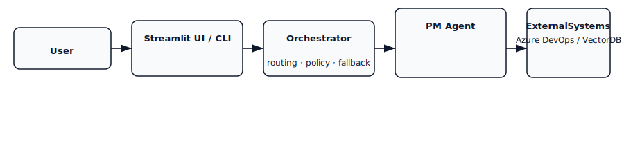
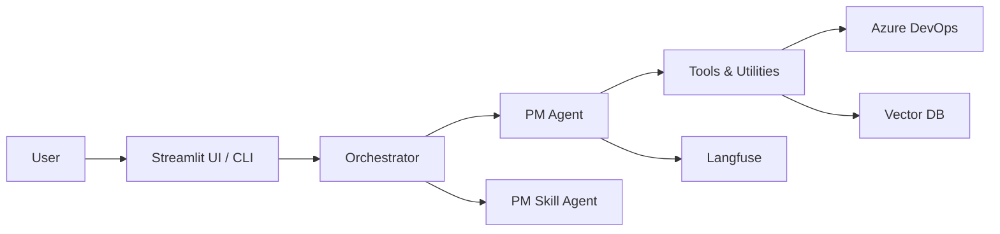

# pm-agent

A production-grade Python conversational system for Azure DevOps — Streamlit UI, hybrid multi-agent orchestration, Langfuse tracing, and vector-powered knowledge search to automate sprint planning, capacity triaging, and evidence-backed reporting.

## Quick Links
- [Run Streamlit UI](scripts/manage_streamlit.py)
- [Generate iteration reports](scripts/generate_iteration_report.py)

## Features
- **Multi-agent architecture:** orchestrator routes queries to specialized agents (`agents/pm_agent`, `agents/pm_skill_agent`, `agents/host_agent`).
- **Streamlit UI & CLI:** interactive workflows and scripts under `app/` and `scripts/`.
- **Azure DevOps integration:** WIQL utilities and REST helpers in `utilities/wiql` and `utilities/ado_async.py`.
- **Knowledge & embeddings:** OpenAI and vector store helpers in `utilities/llm_embeddings.py` and `utilities/vector_db.py`.
- **Tracing & observability (optional):** Langfuse integration in `utilities/langfuse_client.py`.

## Architecture

Below is a high-level architecture diagram showing the main components and data flows.


A simplified request flow is shown here:





## Quickstart

1. Install Python 3.11 and create a virtual environment:

Windows:
```powershell
python -m venv .venv
.venv\\Scripts\\Activate
```
macOS / Linux:
```bash
python -m venv .venv
source .venv/bin/activate
```

2. Install dependencies:
- If the repository includes a `requirements.txt` file:
```bash
pip install -r requirements.txt
```
- Otherwise install the core packages used across the codebase:
```bash
pip install streamlit requests python-dotenv openai langfuse
```

3. Provide environment variables (example):
- `ADO_PAT` or `ADO_MCP_AUTH_TOKEN` (preferred lookup order)
- `ADO_ORG_URL`
- `ADO_PROJECT`
- Optional: `ADO_TEAM`, `AREAS`, `WI_TYPES`, `WIQL_TEXT`/`WIQL_FILE`
- `OPENAI_API_KEY` (if using OpenAI) and `LANGFUSE_API_KEY` (if using Langfuse)

4. Start the Streamlit UI:
```bash
python scripts/manage_streamlit.py
```

5. Generate an iteration report:
```bash
python scripts/generate_iteration_report.py
```

## Project layout

- `agents/` — agent implementations and executors
- `orchestrator/` — routing, guardrails, and synthesis
- `utilities/` — helpers (ADO, LLM, embeddings, vector DB, Langfuse)
- `app/`, `scripts/` — UI entrypoints and automation scripts

## Notes & next steps

- The repository does not include a centralized `requirements.txt`; installing the core packages above will get most features working. For production use, create a pinned `requirements.txt` or `pyproject.toml`.
- If you'd like, I can generate a `requirements.txt` from the codebase and pin versions, or create PNG exports of the diagrams for easier viewing — tell me which you prefer.

--- 
Updated README to add architecture diagrams and clearer quickstart instructions.
